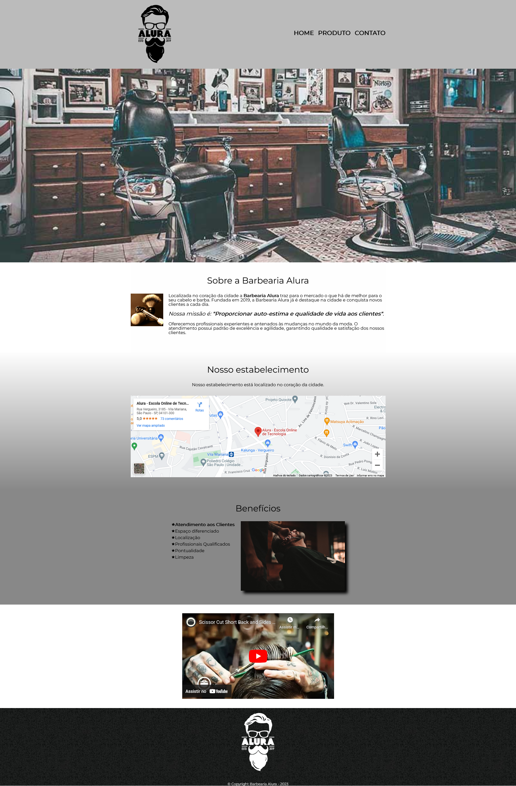

 

 # 
  Barbearia Alura

   

A criação deste projeto foi realizada com intenção de capacitação  através do **React** de onde o código foi reescrito do curso de formação em Front-End - [HTML5 e CSS3 parte 4: avançando no CSS](https://cursos.alura.com.br/course/html5-css3-avancando-css) da **Alura**.

